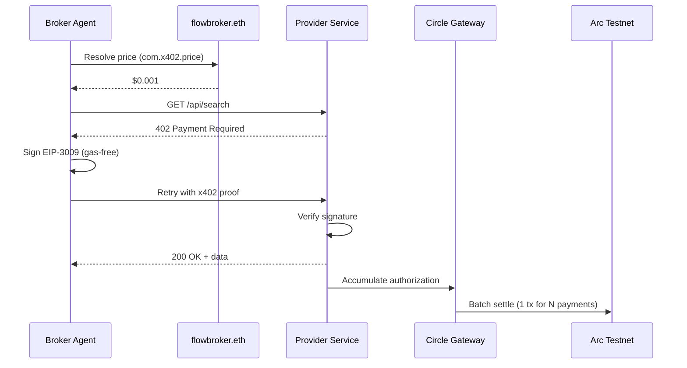
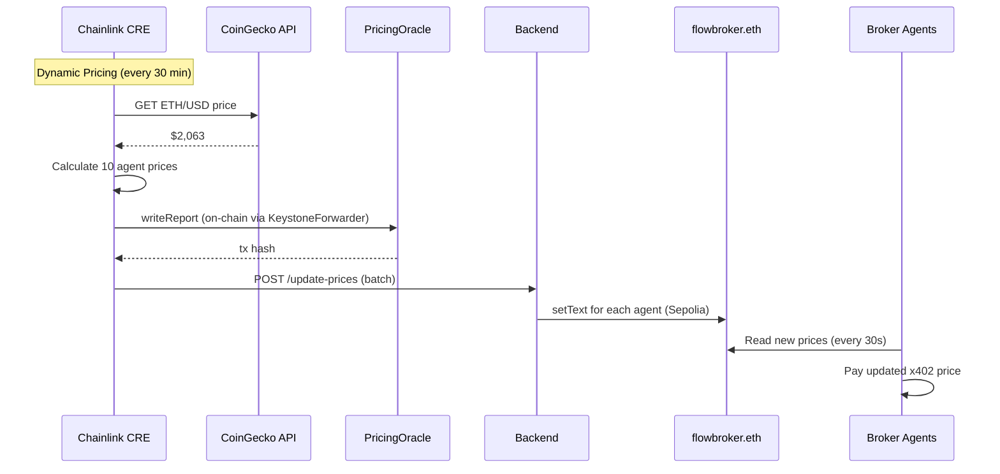

# Flow Broker

Autonomous AI Broker on Arc. 8 broker agents buy financial intelligence from 10 provider agents per-use via x402 nanopayments (Circle Gateway), discovered via ENS, orchestrated by Chainlink CRE.

## Architecture

```mermaid
graph TB
    subgraph User Flow
        U[User] -->|1. Quiz| C[Client App]
        C -->|2. Deposit USDC| ARC[Arc Testnet]
        C -->|3. View activity| D[Dashboard]
    end

    subgraph Agent Economy
        B1[Guardian] & B2[Sentinel] & B3[Steady] & B4[Navigator] & B5[Growth] & B6[Momentum] & B7[Apex] & B8[Titan]
        P1[Market Data] & P2[Sentiment] & P3[LLM] & P4[Embeddings] & P5[Classify] & P6[On-chain] & P7[Macro] & P8[Portfolio] & P9[Execution] & P10[Reports]
        B1 & B2 & B3 & B4 & B5 & B6 & B7 & B8 -->|x402 nanopayment| P1 & P2 & P3 & P4 & P5 & P6 & P7 & P8 & P9 & P10
    end

    subgraph Chainlink CRE Orchestration
        CRE1[Health Monitor] -->|every 5min| BE[Backend API]
        CRE2[Dynamic Pricing] -->|every 30min| PO[PricingOracle]
        CRE2 -->|update prices| BE
        BE -->|update| ENS[flowbroker.eth]
        CRE3[Settlement Monitor] -->|on threshold event| PA[PaymentAccumulator]
        CRE3 -->|notify| BE
    end

    subgraph Settlement
        P1 & P2 & P3 -->|accumulate| GW[Circle Gateway]
        GW -->|batch settle| ARC
    end

    ENS -->|price discovery| B1 & B2 & B3
    BE -->|WebSocket| D
```



## Live

| | URL |
|---|---|
| **Landing** | https://flowbroker.netlify.app |
| **Dashboard** | https://flowbroker-app.netlify.app |
| **API** | https://api.perkmesh.perkos.xyz |
| **ENS** | [flowbroker.eth](https://sepolia.app.ens.domains/flowbroker.eth) (Sepolia) |

## How it works

1. User takes a quiz on the client app -> assigned a broker (Guardian -> Titan)
2. User deposits USDC on Arc Testnet to activate their broker
3. Broker autonomously buys financial intelligence from 10 providers via x402 nanopayments
4. Each call: buyer signs EIP-3009 authorization (gas-free) -> seller verifies -> data returned
5. Circle Gateway batches all signed authorizations -> settles as 1 on-chain tx
6. Chainlink CRE orchestrates the agent economy:
   - Health Monitor (5min): pings agent endpoints, detects downtime
   - Dynamic Pricing (30min): fetches ETH/USD -> calculates prices -> writes PricingOracle on-chain -> updates ENS text records -> agents read new prices
   - Settlement Monitor: detects batch threshold events on-chain -> confirms stats -> notifies backend
7. Dashboard shows all 8 brokers buying intelligence simultaneously in real-time

## x402 Payment Flow



- SDK: `@circle-fin/x402-batching`
- Scheme: `GatewayWalletBatched`
- Authorization: EIP-3009 TransferWithAuthorization
- Settlement: Circle Gateway Batch (NOT per-transaction)
- Gas cost for buyer: $0.00 per payment (gas-free signatures)

## CRE Orchestration Flow



## Structure

| Directory | What |
|-----------|------|
| `client/` | Next.js landing page -- quiz, broker selection, wallet activation |
| `app/` | Next.js dashboard -- real-time flow visualization, payment feed, settlement tracking |
| `arc/backend/` | Express server -- 10 x402 services, 8 worker agents, WebSocket broadcaster |
| `arc/contracts/` | 5 Solidity contracts -- AgentRegistry, AgenticCommerce, PaymentAccumulator, PricingOracle, ReputationHook |
| `chainlink/` | 3 CRE workflows -- health monitor, dynamic pricing, settlement monitor |
| `ens/` | ENS resolver -- agent discovery via flowbroker.eth subnames |

## Contracts (Arc Testnet - Chain ID 5042002)

| Contract | Address |
|----------|---------|
| AgentRegistry | [0xE9bFA497e189272109540f9dBA4cb1419F05cdF0](https://testnet.arcscan.app/address/0xE9bFA497e189272109540f9dBA4cb1419F05cdF0) |
| AgenticCommerce | [0xDA5352c2f54fAeD0aE9f53A17E718a16b410259A](https://testnet.arcscan.app/address/0xDA5352c2f54fAeD0aE9f53A17E718a16b410259A) |
| PaymentAccumulator | [0x627eE346183AB858c581A8F234ADA37579Ff1b13](https://testnet.arcscan.app/address/0x627eE346183AB858c581A8F234ADA37579Ff1b13) |
| PricingOracle | [0xdF5e936A36A190859C799754AAC848D9f5Abf958](https://testnet.arcscan.app/address/0xdF5e936A36A190859C799754AAC848D9f5Abf958) |
| ReputationHook | [0x18d9a536932168bCd066609FB47AB5c1F55b0153](https://testnet.arcscan.app/address/0x18d9a536932168bCd066609FB47AB5c1F55b0153) |
| USDC | [0x3600000000000000000000000000000000000000](https://testnet.arcscan.app/address/0x3600000000000000000000000000000000000000) |
| Gateway Wallet | [0x0077777d7EBA4688BDeF3E311b846F25870A19B9](https://testnet.arcscan.app/address/0x0077777d7EBA4688BDeF3E311b846F25870A19B9) |

## ENS (Sepolia)

**flowbroker.eth** -- 18 subnames: 8 brokers + 10 providers
[View on ENS](https://sepolia.app.ens.domains/flowbroker.eth)

## Brokers

| Broker | Profile | Cost | Risk | Providers |
|--------|---------|------|------|-----------|
| Guardian | Conservative | ~$3/mo | Low | search |
| Sentinel | Conservative | ~$5/mo | Low | search, sentiment |
| Steady | Balanced | ~$10/mo | Medium | search, sentiment, llm |
| Navigator | Balanced | ~$15/mo | Medium | search, sentiment, llm, code |
| Growth | Growth | ~$25/mo | Med-High | search, sentiment, embeddings, classify, data |
| Momentum | Growth | ~$35/mo | Med-High | + translate |
| Apex | Alpha | ~$50/mo | High | 8 core services |
| Titan | Alpha | ~$75/mo | High | all 10 services |

## Run locally

```bash
# Terminal 1: Backend
cd arc/backend && npm install && PORT=3001 WS_PORT=3002 npm run server

# Terminal 2: Dashboard
cd app && npm install && PORT=3005 npm run dev

# Terminal 3: Client (optional)
cd client && npm install && npm run dev

# Terminal 4: CRE demo (optional)
cd chainlink && ./run-demo.sh
```

Environment files needed:
- `arc/backend/.env` -- SELLER_KEY, BUYER_KEY, DEPLOYER_KEY, WORKER_1-8_KEY
- `app/.env.local` -- NEXT_PUBLIC_BACKEND_URL, NEXT_PUBLIC_WS_URL
- `client/.env.local` -- NEXT_PUBLIC_DASHBOARD_URL, NEXT_PUBLIC_WC_PROJECT_ID
- `chainlink/.env` -- CRE_ETH_PRIVATE_KEY

## Tech Stack

- **Payments:** Circle x402 Gateway SDK (`@circle-fin/x402-batching`)
- **Contracts:** Solidity, Foundry, OpenZeppelin (Arc Testnet)
- **Backend:** TypeScript, Express, viem, WebSocket
- **Frontend:** Next.js 16, React 19, React Flow, RainbowKit, wagmi, Tailwind CSS
- **Automation:** Chainlink CRE (TypeScript SDK -> WASM)
- **Identity:** ENS (Sepolia), ERC-8183 (Agentic Commerce Protocol)
