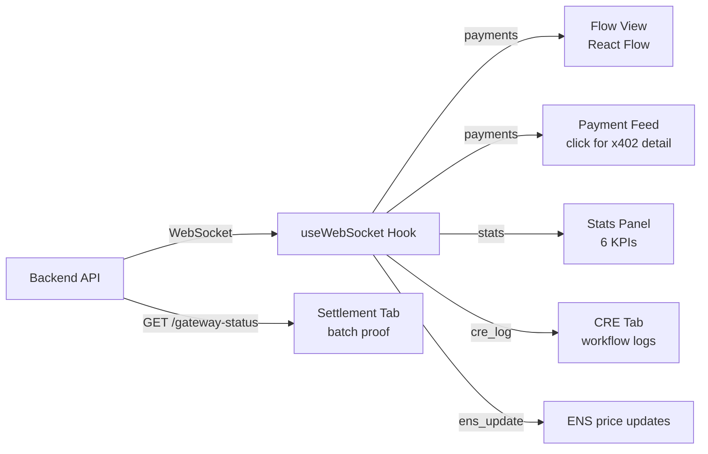

# Dashboard

Next.js app that visualizes the agent economy in real-time. Shows 8 broker agents buying intelligence from 10 providers via x402 nanopayments.

## Data Flow



## Features

- **Flow View** -- React Flow visualization of broker-to-provider payment edges (animated, thickness = call count)
- **Live Payment Feed** -- Click any transaction to see full x402 SDK response (scheme, authorization type, settlement status)
- **Stats Panel** -- x402 calls, volume, fees (10%), active brokers, gas saved, rate
- **Settlement Tab** -- Circle Gateway batch status, 5-step lifecycle diagram, gas savings proof
- **Calls Tab** -- Full payment log with x402 protocol details per transaction
- **CRE Tab** -- Chainlink workflow execution results and logs
- **Verify Tab** -- On-chain contract addresses with ArcScan links, ENS info
- **Protocols Tab** -- x402, ENS, and CRE integration details with live demos

## x402 Payment Details Shown

Each transaction shows:
- `scheme: GatewayWalletBatched`
- `authorization: EIP-3009 TransferWithAuthorization`
- `network: eip155:5042002`
- `settled_on_chain: false` (in batch, pending Circle settlement)
- `gas_cost_for_buyer: $0.00` (gas-free signatures)
- Gateway reference (NOT an on-chain tx hash)
- Link to payer wallet on ArcScan

## Run

```bash
cd app
npm install
cp .env.example .env.local
PORT=3005 npm run dev
```

## Environment

```bash
# app/.env.local
NEXT_PUBLIC_BACKEND_URL=http://localhost:3001    # backend API
NEXT_PUBLIC_WS_URL=ws://localhost:3002           # WebSocket for live updates
```

For production (connects to VPS):
```bash
NEXT_PUBLIC_BACKEND_URL=https://api.perkmesh.perkos.xyz
NEXT_PUBLIC_WS_URL=wss://api.perkmesh.perkos.xyz/ws
```

## WebSocket Events

The dashboard connects to the backend WebSocket and receives:

| Event | Data | Purpose |
|-------|------|---------|
| `payment` | worker, service, amount, scheme, protocol, verified, transaction, fee | Each x402 nanopayment |
| `stats` | totalPayments, totalVolume, paymentsPerMin, activeWorkers, gasSaved | Aggregate metrics |
| `worker_joined` | name, address | Broker started |
| `worker_finished` | name | Broker completed all cycles |
| `complete` | final stats | All workers done |
| `cre_log` | workflow, level, message | CRE workflow logs |
| `ens_update` | agent, value, tx | ENS price change |

## Components

| Component | File | Purpose |
|-----------|------|---------|
| Dashboard | `src/components/dashboard.tsx` | Main layout, tabs, stats, controls |
| FlowView | `src/components/flow-view.tsx` | React Flow broker-to-provider visualization |
| BountyPanel | `src/components/bounty-panel.tsx` | Protocol integration details (x402, ENS, CRE) |
| useWebSocket | `src/lib/useWebSocket.ts` | WebSocket connection, state management |
| agents | `src/lib/agents.ts` | Broker/provider definitions, address mapping |

## Tech

- Next.js 16, React 19, @xyflow/react, Tailwind CSS
- RainbowKit + wagmi (wallet connection in header)
- WebSocket for real-time updates

## Deploy

Netlify with `@netlify/plugin-nextjs`.

## Live

https://flowbroker-app.netlify.app
