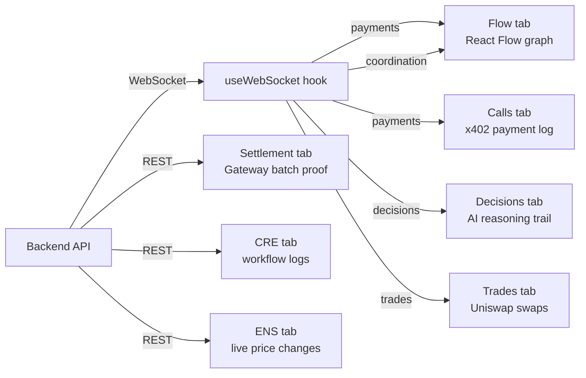

# Dashboard App

Real-time visualization of the agent economy. Shows 8 brokers buying intelligence from 10 providers, executing Uniswap trades, and coordinating through the network.

## What you see



## Tabs

**Flow** — React Flow graph. Broker nodes (red) on the left, provider nodes (green) on the right. Animated edges appear as brokers pay providers. ERC-8004 identity link on each broker node.

**Calls** — Every x402 payment logged in real time. Click any row to see the full Circle Gateway response: scheme, authorization type, network, settlement status.

**Decisions** — AI reasoning trail. Shows what intelligence each broker collected and what decision it made before trading.

**Trades** — Uniswap swaps. Each entry shows tokenIn, tokenOut, routing strategy, and Sepolia Etherscan link. Different brokers use different token pairs based on their risk profile.

**Settlement** — Circle Gateway batch status. Shows how individual nanopayments accumulate into single onchain transactions. Displays gas savings.

**CRE** — Chainlink workflow execution logs. Click to run all 3 workflows and see real simulation output.

**ENS** — Live price change demo. Update a provider price in ENS, watch brokers adapt.

**Protocols** — Technical details for Arc, ENS, and Chainlink — with live demos embedded.

## Run locally

```bash
cd app
npm install

# Create .env.local
echo "NEXT_PUBLIC_WS_URL=wss://api.perkmesh.perkos.xyz/ws" > .env.local
echo "NEXT_PUBLIC_BACKEND_URL=https://api.perkmesh.perkos.xyz" >> .env.local

npm run dev
# Opens at http://localhost:3000
```

The dashboard connects to the production backend — no local server needed.
