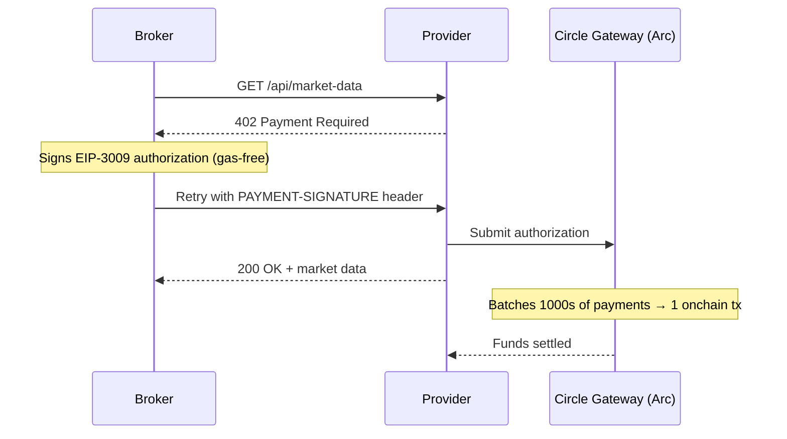
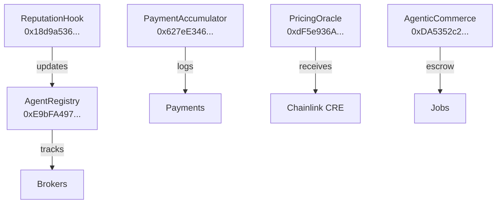

# Arc — x402 Nanopayments + Smart Contracts

Flow Broker runs on Arc Testnet (chain 5042002), where USDC is the native gas token. Every intelligence call between a broker and a provider is a real USDC payment, gas-free.

## How we use Arc

Brokers pay providers using Circle Gateway's x402 protocol. Each call costs between $0.000002 (market data) and $0.015 (AI analysis). Payments are signed offchain using EIP-3009, then batched by Circle Gateway into a single onchain transaction.



## Payment flow stats

- Every intelligence call = 1 x402 payment on Arc
- 5,800+ real payments executed
- $11+ USDC earned by providers (visible on ArcScan)
- Gas saved vs individual txs: $1,500+

## Smart contracts

All 5 contracts deployed on Arc Testnet:



## ERC-8004 identity

All 8 broker agents have registered identities on Arc's official IdentityRegistry (`0x8004A818...`). Token IDs #1448–1455. Each identity NFT is owned by the broker's wallet and links to metadata.

## Run locally

```bash
cd arc/backend
npm install
cp .env.example .env   # add SELLER_KEY, WORKER_1-8_KEY, DEPLOYER_KEY
npm run server         # starts on port 3001 (API) + 3002 (WebSocket)
```

```bash
cd arc/contracts
forge install
forge test             # 40 tests, all passing
forge script script/Deploy.s.sol --rpc-url https://rpc.testnet.arc.network --broadcast
```
