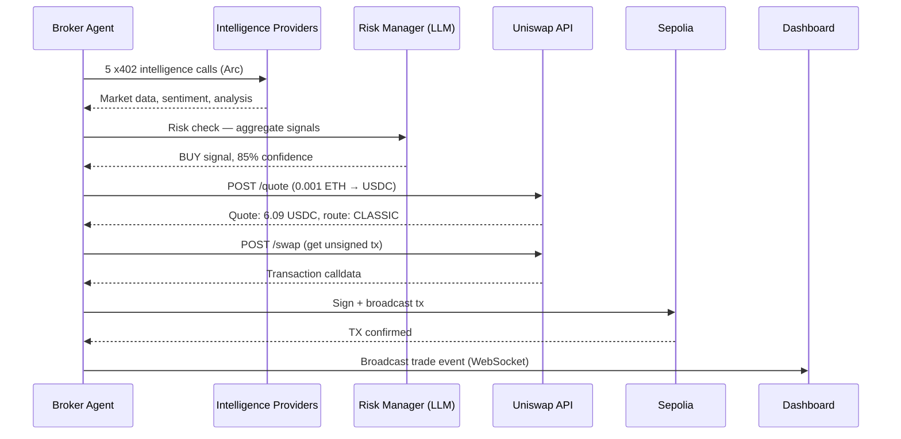

# Backend

Express server with 10 x402-protected intelligence services, 8 worker broker agents, and WebSocket broadcaster.

## Architecture

```mermaid
graph TB
    subgraph Express Server :3001
        MW[x402 Gateway Middleware]
        S1[/api/search] & S2[/api/llm] & S3[/api/sentiment] & S4[...7 more]
        START[POST /start]
        GWS[GET /gateway-status]
        SETTLE[POST /settle]
        UPD[POST /update-prices]
    end

    subgraph Workers
        W1[Guardian] & W2[Sentinel] & W3[...] & W8[Titan]
    end

    subgraph WebSocket :3002
        WS[Broadcast]
    end

    subgraph External
        ENS[flowbroker.eth]
        GW[Circle Gateway]
        CRE[Chainlink CRE]
    end

    START -->|launch 8 workers| W1 & W2 & W3 & W8
    W1 & W2 & W3 & W8 -->|GatewayClient.pay| MW
    MW -->|verify x402| S1 & S2 & S3 & S4
    MW -->|accumulate| GW
    S1 & S2 -->|payment event| WS
    WS -->|real-time| Dashboard

    ENS -->|prices every 30s| MW
    CRE -->|POST /settle| SETTLE
    CRE -->|POST /update-prices| UPD
    UPD -->|setText| ENS
```

## x402 Integration

Uses Circle Gateway SDK for real nanopayments on Arc Testnet:

```
Seller: createGatewayMiddleware({ sellerAddress })  ->  gateway.require("$0.001")
Buyer:  new GatewayClient({ chain: "arcTestnet", privateKey })  ->  client.pay(url)
```

- SDK: `@circle-fin/x402-batching` (server + client)
- Each `client.pay()` signs an EIP-3009 TransferWithAuthorization (gas-free)
- Middleware verifies signature and attaches `req.payment` (payer, amount, verified, transaction)
- Circle Gateway batches all authorizations -> settles as 1 on-chain tx
- `transaction` field is a gateway reference, NOT an on-chain tx hash

## Services (10 providers)

| Service | Endpoint | Price | Method |
|---------|----------|-------|--------|
| search | /api/search | $0.001 | GET |
| sentiment | /api/sentiment | $0.0003 | GET |
| classify | /api/classify | $0.0004 | GET |
| data | /api/data | $0.001 | GET |
| embeddings | /api/embeddings | $0.0005 | GET |
| llm | /api/llm | $0.015 | POST |
| translate | /api/translate | $0.005 | POST |
| summarize | /api/summarize | $0.015 | POST |
| vision | /api/vision | $0.03 | POST |
| code | /api/code | $0.03 | POST |

Prices come from ENS text records (`com.x402.price` on flowbroker.eth). Refreshed every 30s.

## Worker Orchestration

POST `/start` launches 8 parallel broker workers. Each worker:
1. Creates a `GatewayClient` with its own private key
2. Checks balance, deposits USDC if needed
3. Loops N cycles: picks random service from its provider list, calls `client.pay()`
4. Risk manager validation every 5 calls
5. Broadcasts payment events via WebSocket

Broker profiles determine which services each worker calls (Guardian = search only, Titan = all 10).

## WebSocket Events

Port 3002 (configurable via WS_PORT). Broadcasts:
- `payment` -- each x402 nanopayment (worker, service, amount, scheme, protocol, verified, transaction, fee)
- `stats` -- aggregate metrics (totalPayments, totalVolume, paymentsPerMin, gasSaved, activeWorkers)
- `worker_joined` / `worker_finished` -- worker lifecycle
- `complete` -- all workers done
- `cre_log` / `cre_result` -- CRE workflow events
- `ens_update` -- ENS price changes

## Run

```bash
cd arc/backend
npm install
cp .env.example .env  # add wallet keys
PORT=3001 WS_PORT=3002 npm run server
```

## Environment

```
SELLER_KEY=0x...          # seller wallet private key (funded with USDC on Arc Testnet)
BUYER_KEY=0x...           # buyer wallet (for single agent tests)
WORKER_1_KEY=0x...        # worker wallets (up to 8)
...
WORKER_8_KEY=0x...
DEPLOYER_KEY=0x...        # contract deployer/owner wallet
```

## Endpoints

| Endpoint | Method | Purpose |
|----------|--------|---------|
| /health | GET | Server status |
| /prices | GET | Current ENS-resolved prices |
| /start | POST | Launch 8 worker agents (body: { cycles, profile }) |
| /stop | POST | Stop workers |
| /gateway-status | GET | Circle Gateway balance, batch info, recent payments |
| /settle | POST | CRE Settlement Monitor callback — records batch settlement |
| /update-prices | POST | CRE Dynamic Pricing callback — batch updates ENS text records |
| /trades | GET | List Uniswap trades executed by brokers (max 20/session) |
| /cre-run | POST | Execute CRE workflow simulations |
| /cre-logs | GET | CRE execution logs |
| /change-price | POST | Update ENS text record on Sepolia |
| /registry | GET | On-chain agent count from AgentRegistry |
| /api/{service} | GET/POST | x402-protected intelligence services |

## Scripts

```bash
npm run server        # Express API + WebSocket
npm run seller        # Standalone seller (10 services)
npm run buyer         # Single buyer agent
npm run orchestrator  # 8 workers + WebSocket
npm run jobs          # ERC-8183 job lifecycle demo
```

## Uniswap API Trading

Brokers execute real swaps on Sepolia testnet via the Uniswap Trading API when they receive a BUY signal from intelligence providers.



- **API:** `https://trade-api.gateway.uniswap.org/v1`
- **Chain:** Sepolia (11155111)
- **Pair:** ETH → USDC (0x1c7D4B196Cb0C7B01d743Fbc6116a902379C7238)
- **Amount:** 0.001 ETH per trade
- **Max:** 20 trades per session
- **Trigger:** Every 5 intelligence calls, if BUY signal

## Key Addresses

- Arc Testnet RPC: https://rpc.testnet.arc.network
- USDC: 0x3600000000000000000000000000000000000000
- Gateway Wallet: 0x0077777d7EBA4688BDeF3E311b846F25870A19B9
