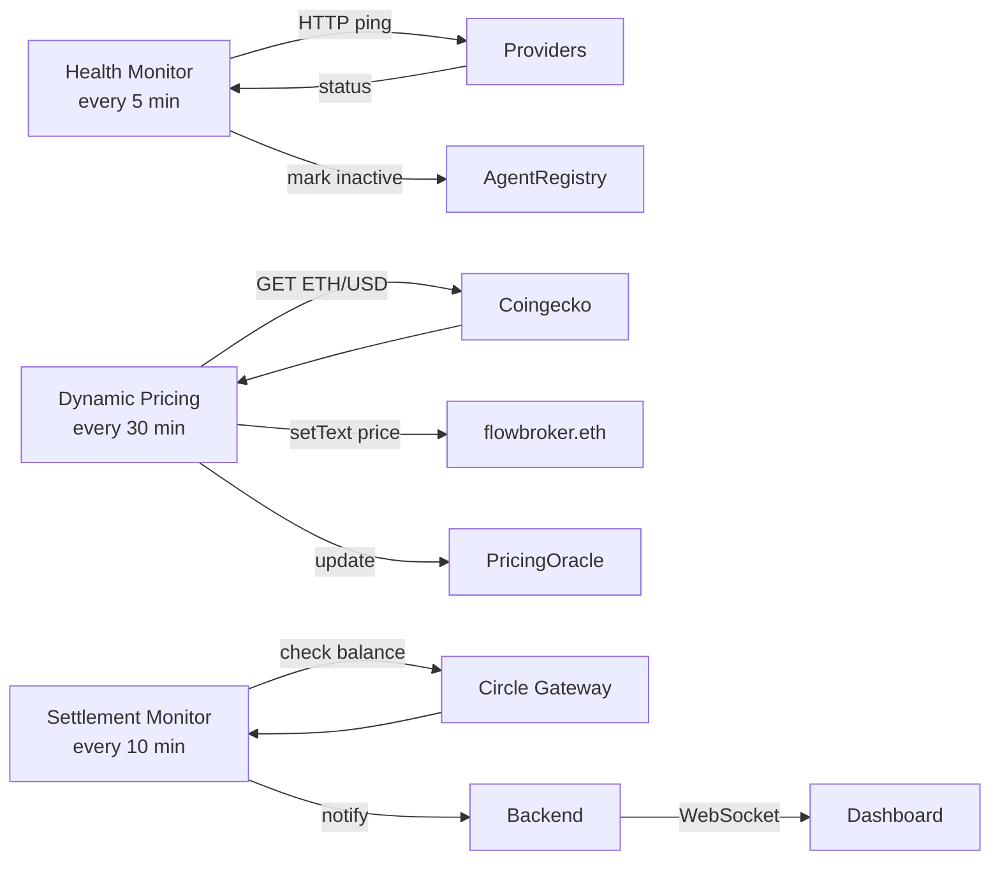

# Chainlink CRE — Decentralized Orchestration

Three CRE workflows run on a schedule, keeping the system healthy and responsive without a centralized server. Compiled to WASM, simulated locally, deployed by the Chainlink team at the hackathon.

## How we use CRE



## Workflows

**Agent Health Monitor** — pings each provider's `/health` endpoint every 5 minutes. If a provider is down, it marks it inactive in the AgentRegistry contract. Brokers skip inactive providers on their next cycle.

**Dynamic Pricing Oracle** — fetches ETH/USD from CoinGecko every 30 minutes. Recalculates fair prices for each provider based on market conditions. Writes updated prices to the PricingOracle contract and updates ENS text records.

**Settlement Monitor** — checks Circle Gateway's batch settlement status every 10 minutes. Verifies that accumulated nanopayments are settling correctly. Broadcasts status to the dashboard via WebSocket.

## Simulation results

All 3 workflows compiled to WASM and simulated successfully using CRE CLI v1.9.0:

```json
// simulation-results.json (excerpt)
{
  "workflow": "Agent Health Monitor",
  "result": "1-agents-down",
  "binaryHash": "2e7b41e8...",
  "status": "success"
}
```

## Run simulations yourself

```bash
# Install CRE CLI
curl -sSL https://cre.chain.link/install.sh | sh
cre login

# Simulate all workflows
cd chainlink
bash run-demo.sh
```

Or simulate individually:
```bash
cd chainlink/agent-health-monitor
bun install
cre workflow simulate . --target staging-settings
```
