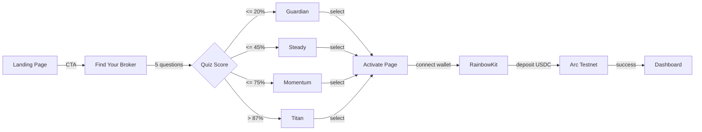

# Client

Next.js landing page for Flow Broker. Users take a quiz, get matched to a broker, and activate it with USDC.

## User Journey



## User Flow

1. **Landing** (`/`) -- Hero, how it works, pricing, comparison sections
2. **Find Your Broker** (`/find-your-broker`) -- 5-question risk profile quiz
3. **Results** -- Shows matched broker with cost, services, risk level + compare all 8
4. **Activate** (`/activate/[broker]`) -- Deposit USDC to broker wallet on Arc Testnet
5. **Dashboard** -- Links to live dashboard (configurable via env)

## Quiz Scoring

5 questions, 3 options each (score 1-3). Total score mapped to broker:
- <=20%: Guardian | <=30%: Sentinel | <=45%: Steady | <=55%: Navigator
- <=65%: Growth | <=75%: Momentum | <=87%: Apex | >87%: Titan

## Wallet Activation

- Uses wagmi + RainbowKit for wallet connection
- Transfers USDC to broker-specific wallet on Arc Testnet (chain ID 5042002)
- Each broker has its own deposit address (hardcoded in `wallet-activation.tsx`)
- USDC contract: `0x3600000000000000000000000000000000000000`

## Run

```bash
cd client
npm install
npm run dev
```

## Environment

```bash
# client/.env.local (all optional -- has fallbacks)
NEXT_PUBLIC_DASHBOARD_URL=http://localhost:3005           # or https://flowbroker-app.netlify.app
NEXT_PUBLIC_WC_PROJECT_ID=your_walletconnect_project_id   # fallback hardcoded
NEXT_PUBLIC_BACKEND_URL=http://localhost:3001              # for embedded dashboard
NEXT_PUBLIC_WS_URL=ws://localhost:3002                     # for embedded dashboard
```

## Pages

| Route | Component | Purpose |
|-------|-----------|---------|
| `/` | Landing sections | Marketing funnel |
| `/find-your-broker` | Quiz + Results | Risk profile -> broker match |
| `/how-it-works` | Info page | Step-by-step explanation |
| `/activate/[broker]` | Deposit form | USDC payment to activate broker |
| `/dashboard` | Embedded dashboard | Real-time agent activity |

## Tech

- Next.js 16, React 19, Tailwind CSS, shadcn/ui
- wagmi + RainbowKit (wallet connection)
- viem (Arc Testnet chain definition)

## Deploy

Netlify with `@netlify/plugin-nextjs`. Static export.

## Live

https://flowbroker.netlify.app
