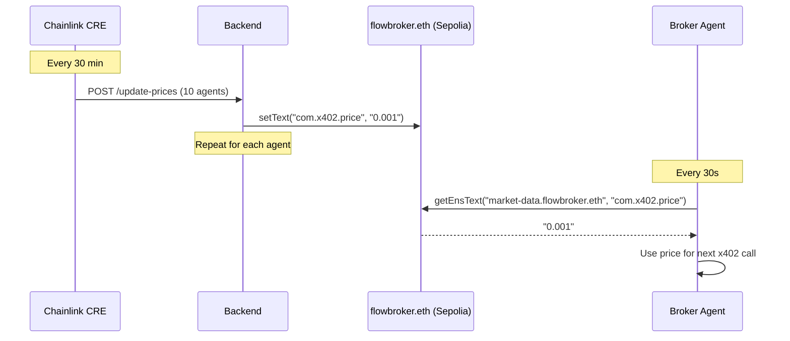

# ENS Integration

Flow Broker uses **flowbroker.eth** (Sepolia) as the agent service mesh for dynamic discovery and pricing.

## Price Discovery Flow

## Domain

[flowbroker.eth on ENS](https://sepolia.app.ens.domains/flowbroker.eth)

## Subnames (18 total)

### 8 Broker Agents
guardian, sentinel, steady, navigator, growth, momentum, apex, titan

### 10 Information Providers
market-data, ai-analysis, sentiment, classifier, portfolio-data, embeddings, translator, summarizer, chart-analyzer, compute

## Text Records per Subname

| Key | Example | Purpose |
|-----|---------|---------|
| `com.x402.price` | "0.001" | Price per call in USDC |
| `com.agent.capabilities` | "Real-time prices" | Service description |
| `com.agent.type` | "provider" or "broker" | Agent role |
| `com.agent.status` | "active" | Current availability |
| `com.agent.providers` | "search,sentiment,llm" | Broker's provider list |

### Broker-specific records
| Key | Purpose |
|-----|---------|
| `com.broker.profile` | Conservative / Balanced / Growth / Alpha |
| `com.broker.cost` | Monthly cost estimate |
| `com.broker.risk` | Risk level |
| `com.broker.strategy` | Trading strategy description |

## How it works

1. Backend calls `discoverAgents()` on startup -- resolves all 18 subnames from Sepolia ENS
2. Extracts prices from `com.x402.price` text records
3. Refreshes every 30 seconds
4. If ENS is unavailable, falls back to hardcoded prices
5. When ENS price changes, agents pay the new price within 30s

## ENS -> Backend Endpoint Mapping

| ENS Subname | Backend Endpoint |
|-------------|-----------------|
| market-data.flowbroker.eth | /api/search |
| ai-analysis.flowbroker.eth | /api/llm |
| sentiment.flowbroker.eth | /api/sentiment |
| classifier.flowbroker.eth | /api/classify |
| portfolio-data.flowbroker.eth | /api/data |
| embeddings.flowbroker.eth | /api/embeddings |
| translator.flowbroker.eth | /api/translate |
| summarizer.flowbroker.eth | /api/summarize |
| chart-analyzer.flowbroker.eth | /api/vision |
| compute.flowbroker.eth | /api/code |

## Resolver

`ens/src/ens-resolver.ts` provides:
- `discoverProviders()` -- fetch all 10 providers with prices
- `discoverBrokers()` -- fetch all 8 brokers
- `discoverBrokerProfiles()` -- full broker metadata
- `resolveAgent(name)` -- single agent lookup
- `toServiceConfigs()` -- convert to backend ServiceConfig format

Uses viem ENS client on Sepolia RPC (`https://ethereum-sepolia-rpc.publicnode.com`).
