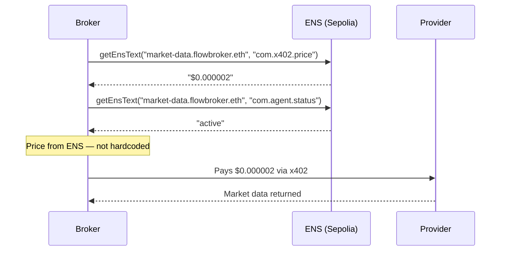

# ENS — Agent Discovery via flowbroker.eth

Brokers discover providers through ENS, not hardcoded URLs. Every provider has a subname under `flowbroker.eth` with text records storing its price, capabilities, and status. Change a text record and brokers adapt within 30 seconds.

## How we use ENS



## What's registered

**flowbroker.eth** on Sepolia — 18 subnames total.

```mermaid
graph TD
    FB[flowbroker.eth] --> B1[guardian.flowbroker.eth]
    FB --> B2[sentinel.flowbroker.eth]
    FB --> B3[steady.flowbroker.eth]
    FB --> B4[..."8 brokers total"]
    FB --> P1[market-data.flowbroker.eth]
    FB --> P2[ai-analysis.flowbroker.eth]
    FB --> P3[sentiment.flowbroker.eth]
    FB --> P4[..."10 providers total"]

    P1 -->|com.x402.price| PR1["$0.000002/call"]
    P2 -->|com.x402.price| PR2["$0.015/call"]
    P1 -->|com.agent.capabilities| CAP1["price,volume,volatility"]
```

## Text records per agent

| Key | Example value | Used for |
|-----|--------------|---------|
| `com.x402.price` | `0.000002` | What brokers pay per call |
| `com.agent.capabilities` | `price,volume,volatility` | What the provider returns |
| `com.agent.type` | `provider` | broker or provider |
| `com.agent.status` | `active` | Skip if inactive |
| `com.broker.apy` | `9.3%` | Displayed on activate page |
| `com.broker.risk` | `Med-High` | Risk profile |

## Live price change demo

The ENS tab in the dashboard lets you update a provider price in real time. The transaction writes to Sepolia, and the broker reads the new price on its next cycle.

```bash
# Verify on Sepolia ENS
https://sepolia.app.ens.domains/flowbroker.eth
```
